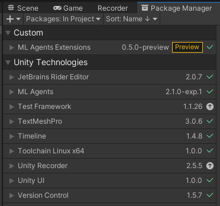

# TrafficFlow

This Unity package contains work in progress on developing a heterogeneous, multiagent system that simulates traffic flow in the context of Non-Player Characters for game design. A Reinforcement Learning approch was equipped.

To use our work please cite the following as a reference:
[1] S. Makri and P. Charalambous, "Towards a multi-agent non-player character road network: a Reinforcement Learning approach" _2021 IEEE Conference on Games (CoG)_, 2021, pp. 1-5, doi: [10.1109/CoG52621.2021.9619047](https://doi.org/10.1109/CoG52621.2021.9619047).
[2] S. Makri and P. Charalambous, "Navigating a road network using Reinforcement
Learning" (in prep.)


### Installation

#### Prerequisites
The TrafficFlow package is implemented in the Unity game engine and utilises the ML-Agents Toolkit. Thus, installation of the following is a prerequisite:

- Install Unity (2019.4 or later)
- Install Python (3.6.1 or higher)
- Clone the [ml-agents repository](https://github.com/Unity-Technologies/ml-agents/tree/release_18) (release_18).
- Install the `mlagents` Python package (0.27.0)

You can refer to the [ml-agents repository documentation](https://github.com/Unity-Technologies/ml-agents/blob/release_18_docs/docs/Installation.md) for more details. We recommend that you follow the [local installation for development](https://github.com/Unity-Technologies/ml-agents/blob/release_18_docs/docs/Installation.md#advanced-local-installation-for-development-2) instructions when installing the `mlagents` Python package.
**NOTE:** You may wish to omit installing the `com.unity.ml-agents` and `com.unity.ml-agents.extensions` Unity packages for the time being. We will come back to this later.

#### Download the Trafficflow repository
Clone this repository.

```sh
git clone --branch v2.1 https://github.com/CYENS/TrafficFlow.git

```

You then need to edit the `./Packages/manifest.json` and `.Packages/packages-lock.json` files as follows.
1. In line 8 of `./Packages/manifest.json`, replace `</path/to/ml-agents>` with the path where you installed the `ml-agents` repository.
1. In line 82 of `./Packages/manifest.json`, replace `</path/to/ml-agents>` with the path where you installed the `ml-agents` repository.

#### Installing the ML-Agents Unity package
Open the `TrafficFlow` project in Unity. You should check that the following Unity packages are listed in the Package Manager.

- `com.unity.ml-agents` Unity package (2.1.0-exp.1)
- `com.unity.ml-agents.extensions` Unity package (0.5.0-preview)

<p align="center">
  
</p>

You can also install these mannually by [adding the local](https://docs.unity3d.com/Manual/upm-ui-local.html) `com.unity.ml-agents` and `com.unity.ml-agents.extensions` packages from the `ml-agents` repository that you have already cloned. You simply need to locate the respective `package.json` files which are found in the `ml-agents/com.unity.ml-agents/` and `ml-agents/com.unity.ml-agents.extensions/` folders. For more details please refer to the [local installation for development](https://github.com/Unity-Technologies/ml-agents/blob/release_18_docs/docs/Installation.md#advanced-local-installation-for-development-1) instructions.

### Getting Started
There are 3 scenes implemented, organised in 3 separate folders under the [`Assets`](./Assets/) folder. Pre-trained model files are provided for each environment. These are located in the respective `Models` folders.
1. The [`Basic`](./Assets/Basic/Scenes/Basic.unity) scene, where our first experiments were carried out. A single agent crosses the traffic lights to reach its target. The lane is quite wide.
1. A [`Lane`](./Assets/Lanes/Scenes/Lane.unity) scene, where we extended the `Basic` scene to train two agents crossing the traffic lights from opposite directions in order to reach their goal.
1. A [`Crossroad`](./Assets/Crossroads/Scenes/Crossroad.unity) scene. Here, we have implemented two different areas. A simple crossroad intersection governed by traffic lights, and a simplified version of the same intersection with motion restricted in a line to help training. For more details you can refer to [Makri and Charalambous (2021)](https://doi.org/10.1109/CoG52621.2021.9619047).
